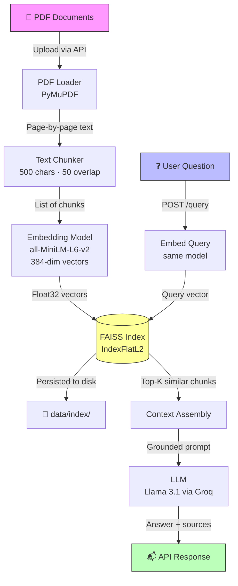
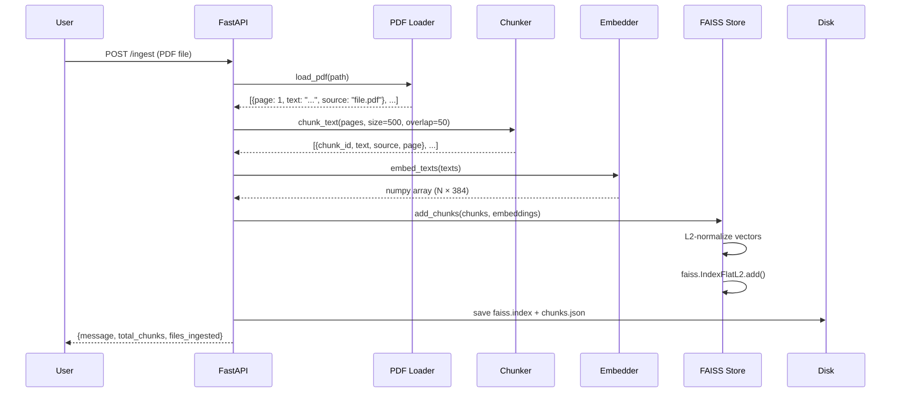
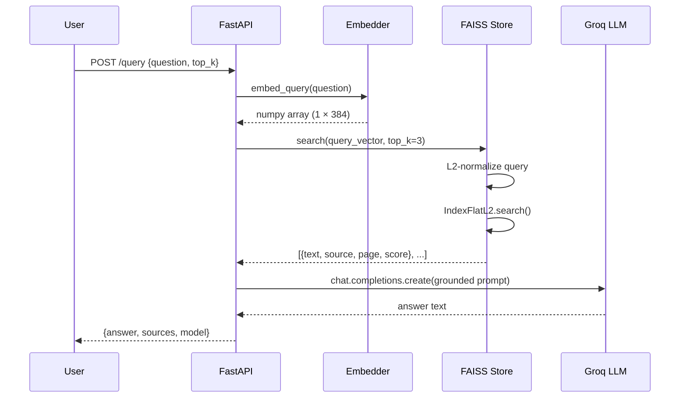
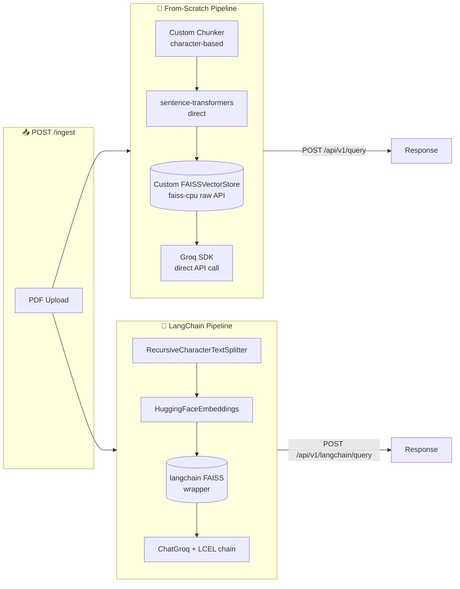
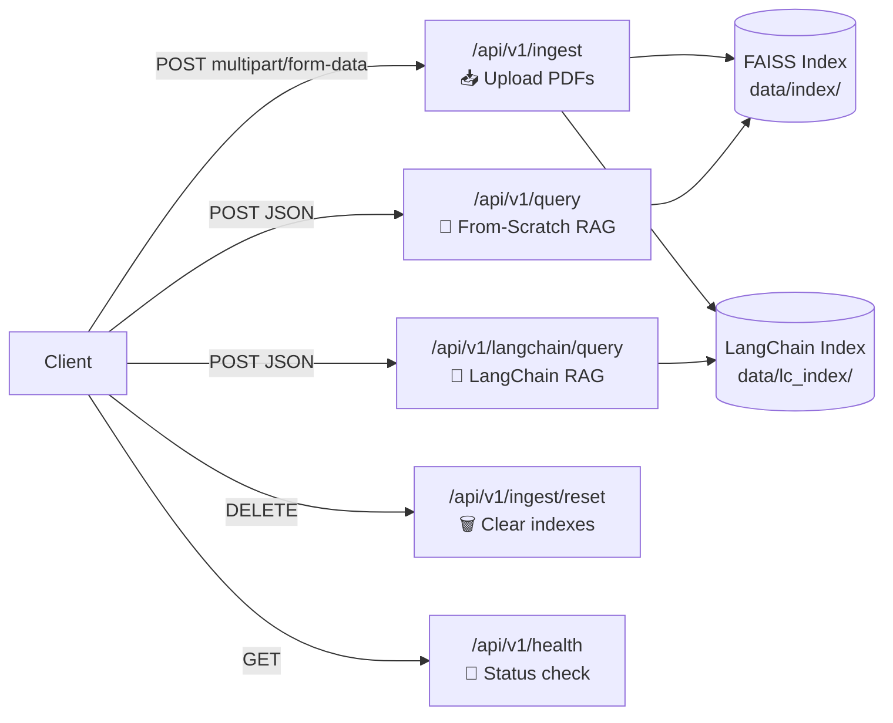
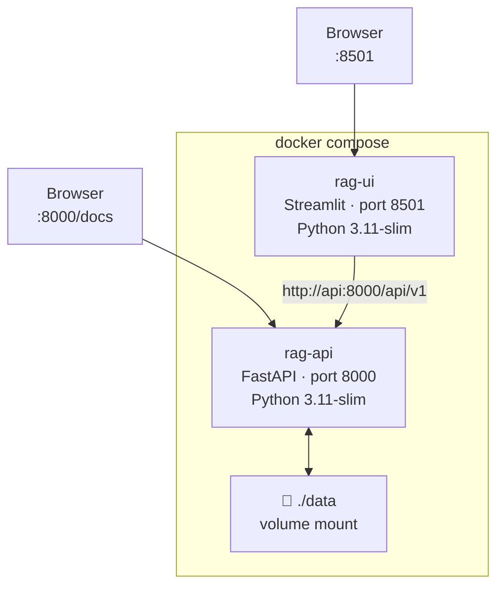

# RAG System — Production-Style Retrieval-Augmented Generation

> Upload any PDF. Ask any question. Get grounded, source-cited answers powered by an LLM — with zero hallucination.

This project implements a **complete Retrieval-Augmented Generation (RAG) pipeline** in two parallel ways:

1. **From-scratch pipeline** — every component hand-built: custom chunker, custom FAISS wrapper, direct Groq SDK calls
2. **LangChain variant** — same pipeline rebuilt using LangChain abstractions, running side-by-side on the same server

Built as a production-quality learning project to deeply understand how RAG systems work at every layer — not just how to call a library.

---

## Table of Contents

- [What is RAG?](#what-is-rag)
- [Live Demo](#live-demo)
- [System Architecture](#system-architecture)
- [Dual Pipeline Design](#dual-pipeline-design)
- [Project Structure](#project-structure)
- [Tech Stack](#tech-stack)
- [Setup & Installation](#setup--installation)
- [Running the App](#running-the-app)
- [API Reference](#api-reference)
- [Streamlit UI](#streamlit-ui)
- [Docker Deployment](#docker-deployment)
- [Key Design Decisions](#key-design-decisions)
- [Pipeline Comparison](#pipeline-comparison)
- [For Recruiters](#for-recruiters)

---

## What is RAG?

Large Language Models (LLMs) like GPT or Llama are powerful but have two critical problems:

1. **Knowledge cutoff** — they don't know about your private documents
2. **Hallucination** — they confidently make up wrong answers

**RAG solves both** by retrieving relevant text from your own documents and feeding it to the LLM as context. The LLM is then instructed to answer *only* from that context — making answers both current and grounded.

```
Without RAG:  User question ──────────────────────► LLM ──► Often hallucinated answer

With RAG:     User question ──► Search your docs ──► LLM ──► Grounded, cited answer
                                      ▲
                               Your PDF documents
```

---

## System Architecture

### High-Level Flow



### Ingestion Pipeline (One-time, per document)



### Query Pipeline (Every question)



---

## Dual Pipeline Design

One of the unique aspects of this project is that **two complete RAG pipelines run on the same server simultaneously**, built from the same data.



Both pipelines use:
- The **same PDF loader** (`PyMuPDF`)
- The **same model** (`all-MiniLM-L6-v2`, 384 dimensions)
- The **same LLM** (`llama-3.1-8b-instant` via Groq)
- The **same chunk size** (500 chars, 50 overlap)
- **Independent** persisted indexes (`data/index/` and `data/lc_index/`)

---

## Project Structure

```
rag-system/
│
├── app/
│   ├── ingestion/
│   │   ├── pdf_loader.py        # PyMuPDF-based PDF text extractor
│   │   └── chunker.py           # Overlapping character-level text chunker
│   │
│   ├── embeddings/
│   │   └── embedder.py          # sentence-transformers model (loaded once at module level)
│   │
│   ├── vectorstore/
│   │   └── faiss_store.py       # Custom FAISS wrapper: add, search, save, load
│   │
│   ├── retrieval/
│   │   └── retriever.py         # Orchestrates: PDF → chunks → embeddings → FAISS
│   │
│   ├── llm/
│   │   └── generator.py         # Groq SDK: builds grounded prompt, calls LLM
│   │
│   ├── langchain_rag.py         # LangChain variant: full pipeline in one class
│   │
│   └── api/
│       └── routes.py            # FastAPI router: all endpoints for both pipelines
│
├── data/
│   ├── raw/                     # Uploaded PDFs (gitignored)
│   ├── index/                   # Persisted from-scratch FAISS index (gitignored)
│   └── lc_index/                # Persisted LangChain FAISS index (gitignored)
│
├── tests/
│   └── test_retriever.py        # Unit + integration tests for retrieval pipeline
│
├── tasks/
│   ├── todo.md                  # Architecture notes and progress tracker
│   └── lessons.md               # Lessons learned during development
│
├── config.py                    # Centralized path and config constants
├── main.py                      # FastAPI app entry point
├── streamlit_app.py             # Streamlit chat UI
├── Dockerfile                   # FastAPI backend container
├── Dockerfile.streamlit         # Streamlit UI container
├── docker-compose.yml           # Wires both containers together
├── requirements.txt             # Full pinned dev dependencies
├── requirements.docker.txt      # Lean runtime deps for Docker
└── .env                         # GROQ_API_KEY (never committed)
```

---

## Tech Stack

| Layer | From-Scratch Pipeline | LangChain Pipeline |
|---|---|---|
| **PDF Parsing** | PyMuPDF (`fitz`) | PyMuPDF (`fitz`) — shared |
| **Chunking** | Custom character splitter | `RecursiveCharacterTextSplitter` |
| **Embeddings** | `sentence-transformers` direct | `HuggingFaceEmbeddings` wrapper |
| **Embedding Model** | `all-MiniLM-L6-v2` (384-dim) | `all-MiniLM-L6-v2` (384-dim) |
| **Vector Store** | Custom `FAISSVectorStore` class | `langchain_community.vectorstores.FAISS` |
| **LLM Client** | `groq` SDK directly | `ChatGroq` |
| **Chain** | Manual prompt + API call | LCEL (`RunnablePassthrough` + `StrOutputParser`) |
| **LLM Model** | `llama-3.1-8b-instant` | `llama-3.1-8b-instant` |
| **API** | FastAPI + Uvicorn | FastAPI + Uvicorn — shared |
| **UI** | Streamlit | Streamlit — shared |
| **Language** | Python 3.11 | Python 3.11 |

---

## Setup & Installation

### Prerequisites

- Python 3.11
- A free [Groq API key](https://console.groq.com) (fast LLM inference, free tier available)
- Git

### 1. Clone the repository

```bash
git clone https://github.com/vivek0402/rag-system.git
cd rag-system
```

### 2. Create a virtual environment

```bash
# Windows
python -m venv venv
venv\Scripts\activate

# Mac / Linux
python3.11 -m venv venv
source venv/bin/activate
```

### 3. Install dependencies

```bash
pip install -r requirements.txt
```

> The full `requirements.txt` is a pinned pip freeze for exact reproducibility. For a lighter install, use `requirements.docker.txt` which contains only the runtime deps.

### 4. Configure your API key

Create a `.env` file in the project root:

```bash
GROQ_API_KEY=your_groq_api_key_here
```

Get your free key at [console.groq.com](https://console.groq.com). Llama 3.1 inference is free and extremely fast on Groq.

---

## Running the App

### API Server only

```bash
uvicorn main:app --reload
```

- API: [http://localhost:8000](http://localhost:8000)
- Interactive docs: [http://localhost:8000/docs](http://localhost:8000/docs)

### API + Streamlit UI (two terminals)

**Terminal 1:**
```bash
uvicorn main:app --reload
```

**Terminal 2:**
```bash
streamlit run streamlit_app.py
```

- UI: [http://localhost:8501](http://localhost:8501)

---

## API Reference

All endpoints are served under the `/api/v1` prefix.

---

### `POST /api/v1/ingest`

Upload one or more PDF files to build the vector index. Both pipelines (from-scratch and LangChain) are indexed simultaneously.

**Request:** `multipart/form-data`

| Field | Type | Description |
|---|---|---|
| `files` | `File[]` | One or more `.pdf` files |

**Response:**

```json
{
  "message": "Successfully ingested 1 file(s)",
  "files_ingested": ["data/raw/document.pdf"],
  "total_files_in_index": 1,
  "total_chunks": 142
}
```

**Example (curl):**
```bash
curl -X POST http://localhost:8000/api/v1/ingest \
  -F "files=@document.pdf"
```

---

### `POST /api/v1/query`

Query the **from-scratch pipeline**. Embeds the question, retrieves top-k chunks from the custom FAISS store, and generates a grounded answer via Groq.

**Request body:**

```json
{
  "question": "What are the main findings of this paper?",
  "top_k": 3
}
```

| Field | Type | Default | Description |
|---|---|---|---|
| `question` | `string` | required | The question to answer |
| `top_k` | `int` | `3` | Number of chunks to retrieve |

**Response:**

```json
{
  "answer": "The main findings are...",
  "sources": [
    {"source": "document.pdf", "page": 4, "score": 0.91},
    {"source": "document.pdf", "page": 7, "score": 0.87}
  ],
  "model": "llama-3.1-8b-instant"
}
```

---

### `POST /api/v1/langchain/query`

Query the **LangChain pipeline**. Identical interface to `/query` — same request, same response shape — but uses LangChain's FAISS retriever and LCEL chain internally.

**Request body:** Same as `/query`

**Response:** Same shape as `/query`

**Example:**
```bash
curl -X POST http://localhost:8000/api/v1/langchain/query \
  -H "Content-Type: application/json" \
  -d '{"question": "Summarize the key points", "top_k": 3}'
```

---

### `DELETE /api/v1/ingest/reset`

Wipe both indexes (from-scratch and LangChain) and clear the ingested files list. Deletes the persisted index files from disk.

**Response:**
```json
{"message": "Index reset successfully."}
```

---

### `GET /api/v1/health`

Health check. Returns index state for both pipelines.

**Response:**
```json
{
  "status": "ok",
  "index_built": true,
  "lc_index_built": true,
  "files_ingested": ["document.pdf"],
  "total_chunks": 142
}
```

---

### Endpoint Summary



---

## Streamlit UI

A full chat interface for non-technical users, built with Streamlit.

```
┌─────────────────────────────────────────────────────────────┐
│  📚 RAG System                                              │
├──────────────────┬──────────────────────────────────────────┤
│                  │                                          │
│  📂 Document     │  You: What are the main findings?        │
│  Management      │                                          │
│                  │  Assistant: Based on the document...     │
│  [Upload PDFs]   │    📎 Sources                            │
│                  │      📄 paper.pdf | Page 4 | Score 0.91  │
│  🚀 Ingest       │                                          │
│                  │  You: ________________________________   │
│  🗑️ Reset Index  │                                          │
│                  │                                          │
│  ✅ 142 chunks   │                                          │
└──────────────────┴──────────────────────────────────────────┘
```

**Features:**
- Multi-file PDF upload
- Chat history with source citations
- Live index status in sidebar
- One-click index reset
- Connects to the FastAPI backend at `http://localhost:8000/api/v1`

---

## Docker Deployment

Run both services with a single command — no Python setup needed.

### Prerequisites
- [Docker Desktop](https://www.docker.com/products/docker-desktop/)

### Start everything

```bash
docker compose up --build
```

This starts:
- `rag-api` — FastAPI backend on port `8000`
- `rag-ui` — Streamlit frontend on port `8501`

The `./data` directory is mounted as a volume so indexes persist across container restarts.

### Services



### Environment variables

The `docker-compose.yml` reads from your `.env` file automatically:

```yaml
env_file:
  - .env
```

### Stop

```bash
docker compose down
```

---

## Key Design Decisions

### Why build from scratch AND with LangChain?

Most tutorials show only the LangChain version — you call a few functions and it works, but you don't understand what's happening. Building the from-scratch version first means every component is understood deeply:

- How chunking affects retrieval quality
- What FAISS actually does with vectors
- Why L2 normalization matters for cosine similarity
- How to structure a grounding prompt to prevent hallucination

The LangChain version then shows what the abstractions are doing and where they help (or add opacity).

---

### Why overlapping chunks?

```
Without overlap:   [chunk 1: "The experiment showed significant"] [chunk 2: "improvement in accuracy"]
                    ↑ "significant improvement" is split — both chunks lose meaning

With overlap:      [chunk 1: "The experiment showed significant improvement"]
                   [chunk 2: "significant improvement in accuracy over baseline"]
                    ↑ The key phrase exists fully in at least one chunk
```

Overlap size (50 chars) is set to ~10% of chunk size (500 chars). Too much overlap wastes storage; too little loses context at boundaries.

---

### Why FAISS over a vector database?

| Option | Pros | Cons |
|---|---|---|
| **FAISS** (chosen) | Zero infra, runs in-process, blazing fast for <1M vectors | No metadata filtering, no persistence layer (built separately) |
| Pinecone / Weaviate | Managed, scalable, filtering | Requires external service, adds latency |
| ChromaDB | Easy to use, persistent by default | More overhead for simple use cases |

For a single-user PDF Q&A system, FAISS is the right tool. The custom `FAISSVectorStore` wrapper adds save/load and chunk metadata tracking on top.

---

### Why L2 normalization before indexing?

```python
faiss.normalize_L2(vectors)
self.index.add(vectors)
```

`IndexFlatL2` computes Euclidean (L2) distance. After L2 normalization, all vectors have magnitude 1, which means L2 distance is equivalent to cosine similarity:

```
‖a - b‖² = 2 - 2·cos(θ)    (when ‖a‖ = ‖b‖ = 1)
```

So we get cosine similarity semantics without changing the index type — cosine similarity is better for text because it ignores vector magnitude (document length bias).

---

### Why a strict grounding prompt?

```
You are a helpful assistant that answers questions based ONLY on the provided context.
If the answer is not in the context, say "I don't have enough information to answer this."
Do NOT use your own knowledge or make up information.
```

Without this constraint, the LLM will mix retrieved context with its training knowledge, producing answers that *sound* right but cite the wrong page or invent details. The strict prompt makes the system auditable: every answer is traceable to a source chunk.

---

### Why load the embedding model once at module level?

```python
# embedder.py — loaded once
model = SentenceTransformer("all-MiniLM-L6-v2")

def embed_texts(texts): ...   # reuses the loaded model
def embed_query(query): ...   # reuses the loaded model
```

Loading a transformer model takes 2–5 seconds and ~90MB of memory. If it were loaded inside the function, every API call would pay that cost. Loading at module level means it's loaded once when the server starts — all requests share the same model instance.

---

## Pipeline Comparison

| Dimension | From-Scratch | LangChain |
|---|---|---|
| **Lines of code** | ~200 across 5 files | ~120 in one file |
| **Dependencies** | `faiss-cpu`, `sentence-transformers`, `groq` | `langchain-*` stack (heavier) |
| **Chunk splitting** | Simple character sliding window | `RecursiveCharacterTextSplitter` (respects sentence/word boundaries) |
| **Score visibility** | Returns cosine similarity score per chunk | Score not exposed through LCEL retriever |
| **Transparency** | Every step explicit | Abstractions hide implementation |
| **Flexibility** | Easy to swap any single component | Tied to LangChain interface contracts |
| **Index format** | `faiss.index` + `chunks.json` | `index.faiss` + `index.pkl` (pickle) |
| **Learning value** | High — understand every layer | Medium — understand the patterns |
| **Production readiness** | Higher control, more boilerplate | Faster iteration, ecosystem integrations |

---

## For Recruiters

This project demonstrates the following skills:

### Machine Learning & NLP
- Embedding-based semantic search with transformer models
- Vector similarity search (FAISS, cosine similarity, L2 normalization)
- LLM prompt engineering for grounded, hallucination-free generation
- Understanding of RAG architecture and retrieval quality tradeoffs

### Software Engineering
- Clean modular architecture with separation of concerns
- Two parallel implementations of the same system for direct comparison
- REST API design with FastAPI (request validation, error handling, response models)
- Persistent storage design (disk-backed FAISS index, survives restarts)
- Containerization with Docker and docker-compose
- Environment configuration and secrets management

### Python Ecosystem
- FastAPI, Pydantic, Uvicorn
- LangChain (LCEL, community integrations)
- sentence-transformers, FAISS
- Groq API (Llama 3.1)
- Streamlit
- pytest

### Engineering Judgment
- Built from scratch before using abstractions — understands what libraries are doing
- Documented design decisions with explicit reasoning
- Tracked lessons learned during development (`tasks/lessons.md`)
- Maintained test coverage across both pipelines

---

## Running Tests

```bash
pytest tests/ -v
```

```
tests/test_retriever.py::test_search_before_build_raises   PASSED
tests/test_retriever.py::test_build_and_search             PASSED
tests/test_retriever.py::test_top_k_respected              PASSED
```

Tests cover: error handling before index is built, end-to-end build + search with a real PDF, and `top_k` contract validation.

---

## Branches

| Branch | Description |
|---|---|
| `main` | Original from-scratch pipeline only |
| `langchain-variant` | Both pipelines running side-by-side |

---

## License

MIT — use freely, attribution appreciated.

---

*Built by [Vivek](https://github.com/vivek0402)*
